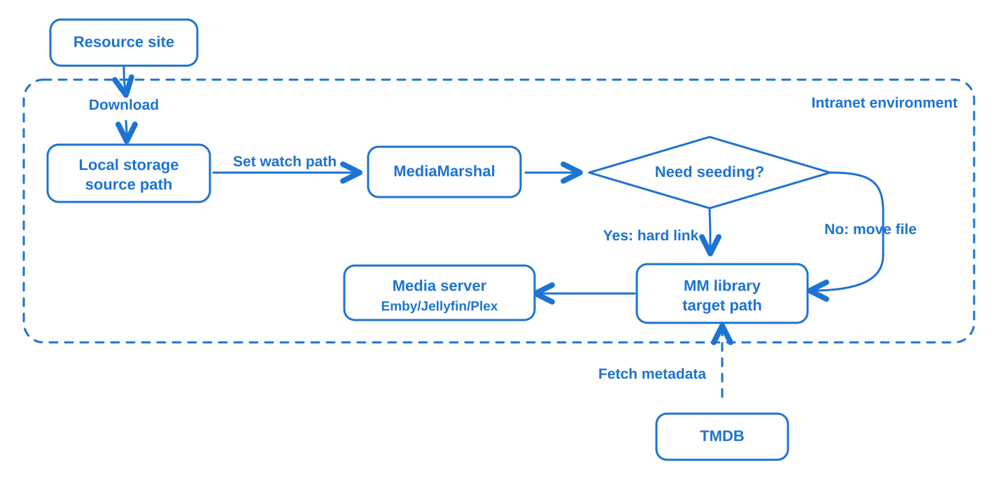
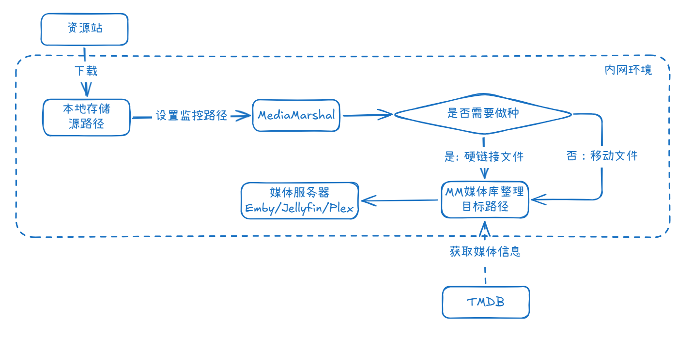

# Media Marshal

[English](#english) | [中文](#中文)

Media Marshal is a self-hosted tool for organizing movie and TV files for Emby, Jellyfin, and Plex.

It watches your staging folders, identifies media with guessit and TMDB, sends uncertain matches to a review queue, and then moves, copies, or links files into your media library with the naming rules you choose.

Current version: `v0.2.8`

---

## English

### What It Does

Media Marshal (MM) is a self-hosted media organizer for Emby, Jellyfin, and Plex users.

It handles the part of media management that is easy to put off: watching a download or staging folder, identifying media, asking you to confirm uncertain matches, and finally organizing files into your library with the naming rules you choose.

It can:

- watch one or more source folders
- parse movie and episode filenames with guessit
- search TMDB for movie and TV metadata
- hold low-confidence results for manual confirmation
- organize files with configurable path templates
- move related subtitles, NFO files, posters, and `.md5` files together with the main video
- show task status and failures in a Web UI

Note: MM is not a downloader or a media server. It does not replace PT download tools, Emby, Jellyfin, or Plex.

### Best Practice



- Download media from external resource sites to a local path, such as `/Resources/Download`.
- Configure a watch rule in Media Marshal. For example, use `/Resources/Download` as the source path and `/Resources/Emby` as the target path.
- Choose the file operation based on whether you need to keep seeding. Use hard links if the source file must stay in place; use move mode if it does not.
- When new files appear in `/Resources/Download`, MM automatically parses them, fetches metadata from TMDB, and organizes video files into `/Resources/Emby`.
- Add the organized media path to your media server.

### Quick Start

Requirements:

- Docker and Docker Compose
- a TMDB API key
- a host folder that contains or will contain your media files

```bash
cp .env.example .env
```

Edit `.env` and set your media root:

```dotenv
MEDIA_DIRS=/path/to/your/media
```

Start the stack:

```bash
# Start with a local build
docker compose --env-file .env -f docker-compose.beta.yml up -d

# Start with official images
docker compose --env-file .env -f docker-compose.yml up -d
```

Open the Web UI:

```text
http://localhost:3000
```

On first launch, you need to enter your TMDB API key in the Web UI. Then add a path rule, using container paths such as:

```text
/media/Downloads
/media/Movies
/media/TV
```

Default ports:

| Service | URL / Port |
|---|---|
| Web UI | `http://localhost:3000` |
| Backend API | `http://localhost:8080` |
| Parser sidecar | internal only |

### Typical Workflow

1. Add a path rule for a source folder and a target library folder.
2. Choose the media type: movie, TV show, or auto.
3. Choose how files should be organized: move, copy, hard link, or symbolic link.
4. Let Media Marshal watch the folder or run a manual scan.
5. Confirm uncertain matches in the queue.
6. Let confirmed files land in your media library.

Useful default templates:

```text
Movie:
{title} ({year})/{title} ({year})[[ - {resolution}]]{ext}

TV:
{title} ({year})/S{season:02d}/{title} ({year}) - S{season:02d}E{episode:02d}[[ - {resolution}]]{ext}
```

### Current Scope

Good fit today:

- regular movie files
- regular TV episode files
- multi-episode files such as `E16-E17`
- manual review for uncertain matches
- fixing recognition results before rematching TMDB
- Chinese / bilingual title matching
- movie Blu-ray folder organization
- common sidecar files such as subtitles, NFO, posters, and `.md5`

Keep in mind:

- no built-in user authentication yet
- trusted LAN / VPN deployment is recommended
- TV Blu-ray folder organization is not supported yet

### Development

Tech stack:

| Microservice | Stack |
|-------|---|
| Backend | Java 21, Spring Boot 3, SQLite |
| Frontend | Vue 3, TypeScript, Vite, Element Plus |
| Parser service | Python, FastAPI, guessit |
| Metadata | TMDB |
| Deployment | Docker Compose |

---

## 中文

### 它是什么

Media Marshal (MM) 是一个面向 Emby / Jellyfin / Plex 用户的自托管媒体整理工具。

它负责处理媒体库里最容易烦人的那一段流程：从下载目录或临时整理目录发现文件，识别影片信息，把拿不准的任务交给你确认，最后按你设置的命名规则整理到媒体库。

它可以：

- 监听一个或多个源目录
- 使用 guessit 解析电影和剧集文件名
- 通过 TMDB 匹配电影 / 剧集元数据
- 低置信度任务进入待确认队列
- 按路径模板移动、复制、硬链接或符号链接文件
- 让字幕、NFO、封面、`.md5` 等附属文件跟随主视频处理
- 在 Web UI 中查看任务状态和失败原因

注意：MM并不是下载器，也不是媒体服务器，不负责替代PT下载工具和 Emby / Jellyfin / Plex等媒体服务器。

### 最佳实践

* 从外部资源站下载媒体资源到本地路径，如：`/Resources/Download`
* 在MediaMarshal中配置监控路径，例如：源路径设为`/Resources/Download`，目标路径为`/Resources/Emby`
* 根据是否做种，设置不同的文件处理模式：如果需要保留源文件继续做种，则设置为硬链接；如果不需要保留源文件，则可以选择移动模式。
* 在源路径`/Resources/Download`中有新增文件时，MM会自动自动解析并按规则从TMDB获取影片信息，根据硬盘信息将视频文件整理到目标路径`/Resources/Emby`下
* 媒体服务器添加视频

### 快速开始

你需要准备：

- Docker 和 Docker Compose
- TMDB API Key
- 一个宿主机媒体目录

复制环境变量模板：

```bash
cp .env.example .env
```

编辑 `.env`，设置媒体目录：

```dotenv
MEDIA_DIRS=/path/to/your/media
```

启动服务：

```bash
# 本地构建方式启动
docker compose --env-file .env -f docker-compose.beta.yml up -d

# 使用官方镜像启动
docker compose --env-file .env -f docker-compose.yml up -d
```

打开页面：

```text
http://localhost:3000
```

首次进入页面后，需填写 TMDB API Key。然后新增路径规则，目录要填写容器内路径，例如：

```text
/media/Downloads
/media/Movies
/media/TV
```

默认端口：

| 服务 | 地址 / 端口 |
|---|---|
| Web UI | `http://localhost:3000` |
| 后端 API | `http://localhost:8080` |
| Parser sidecar | 仅容器内部访问 |

### 基本使用流程

1. 新增路径规则，设置源目录和目标媒体库目录。
2. 选择媒体类型：电影、剧集或自动识别。
3. 选择文件处理方式：移动、复制、硬链接或符号链接。
4. 等待自动发现，或手动扫描目录。
5. 在待确认队列中处理识别不确定的任务。
6. 确认后，文件会按模板进入媒体库。

常用默认模板：

```text
电影：
{title} ({year})/{title} ({year})[[ - {resolution}]]{ext}

剧集：
{title} ({year})/S{season:02d}/{title} ({year}) - S{season:02d}E{episode:02d}[[ - {resolution}]]{ext}
```

### 当前适合做什么

当前版本适合：

- 整理普通电影文件
- 整理普通剧集文件
- 处理 `E16-E17` 这类连续多集文件
- 对低置信度匹配进行人工确认
- 修正解析结果后重新匹配 TMDB
- 匹配中文 / 双语标题
- 整理电影蓝光原盘目录
- 携带字幕、NFO、封面、`.md5` 等常见附属文件

需要注意：

- 当前版本暂无用户认证
- 建议部署在可信内网、VPN 或本机环境
- 暂不支持蓝光剧集整理

### 本地开发

技术栈：

| 微服务模块 | 技术 |
|-------|---|
| 后端    | Java 21, Spring Boot 3, SQLite |
| 前端    | Vue 3, TypeScript, Vite, Element Plus |
| 解析服务  | Python, FastAPI, guessit |
| 元数据   | TMDB |
| 部署    | Docker Compose |

## License

[GPL-3.0](LICENSE)
